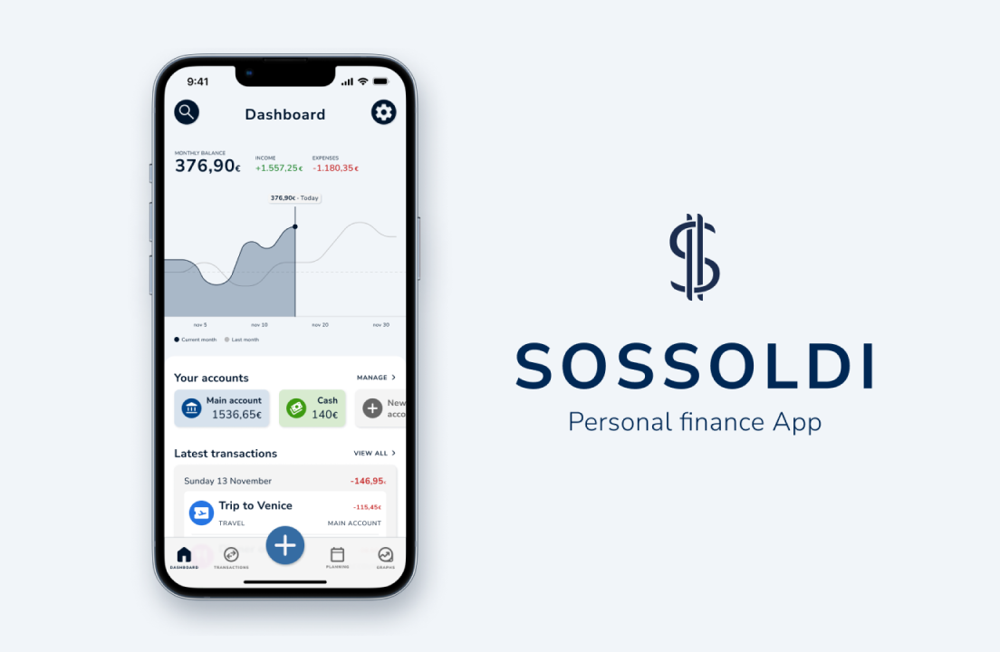

# Sossoldi

**Wealth management app**

    
    

# Sossoldi (Wealth management app)

**Sossoldi** is a free and open source wealth management / personal finance / Net Worth tracking app, made with Flutter.

## ❓ What problem we are solving & why

[Mr. Rip](https://retireinprogress.com/) is a blogger that has a [spreadsheet](https://docs.google.com/spreadsheets/d/1ilL6rBdzIQ6yRotqOKLUKI7KXFxu5_cZ5FQgdYTSHJk/edit#gid=138629885) in which he tracks his net worth. Sossoldi is a Mobile + Desktop app that aims at replacing that spreadsheet and make it easier for everyone to track their net worth even if they are not as skilled with Google sheets or Excel.

The app is being developed using the [Flutter](https://docs.flutter.dev/get-started/install) framework which makes it possible to have one codebase for different platforms (Android, iOS, Windows, macOS, Linux). We are currently working on a beta which hopefully will be out soon.

## This app is for you if you want to...

-   📈 track their net worth
-   💸 track your expenses to better understand where they are spending their money
-   👀 keep track of your investments
-   🪦 keep everything in one place like Mr. Rip

What features do we want to implement?
-   💸 Track expenses (even recurrent ones)
-   🏦 Track different bank accounts
-   📊 Graphs, statistics and reports
-   💻 All data are stored locally (with the option to share it in different platforms)
-   👀 Track investments: Stocks, Bonds, Crypto, Private equity
-   💶 Track taxes
-   💴 Net worth on different currencies
-   ↔️ Import/export data
-   🔗 Link bank accounts that support the OpenBanking PSD2 API
-   🤓 Advanced onboarding

## Phase 1 (Ongoing)
We will not build the complete app all at once. We will start from the basic features and then we will move onto the others.
Phase 1 will be completed when the following features will be ready:
-   💸 Expenses (even recurrent ones) tracker
-   🤑 Income tracker
-   ⚖️ Bank accounts balance (without the use of API)
-   📊 Basic stats
-   📱 Data stored only locally

The pages that will be implemented are:
-   Dashboard
-   Movements page
-   Basic settings
-   Basic onboarding

## Contributing

If you want to help with this project you are more than welcome! Sossoldi is completely free and open source, the best place to start is from the issue tab and look for something that seems interesting to you. If are unsure on where to start feel free to reach out to us on [Discord](https://discord.com/channels/919139369774891088/1013368203575038012), we will be more than happy to help you find what's best for you!

Also, you can refer to internal docs:

-   [Setup Guide](https://rip-comm.github.io/sossoldi/setup/setup.html)
-   [PR Guide](https://rip-comm.github.io/sossoldi/contributing/PR-guide.html)

### Useful links to get started
-   [Github Repo](https://github.com/RIP-Comm/sossoldi)
-   [Discord](http://mr.rip/discord)
-   [Design file](https://www.figma.com/file/6NyY9yqunpbU7HIkbNEAL3/Sossoldi-App?node-id=0%3A1)
-   [UX Research](https://www.federicopozzato.it/portfolio/sossoldi-personal-finance-app)
-   [Information architecture](https://www.figma.com/file/xjVHAaHznRW1OFAJvp8DXn/Sossoldi-App---Figjam?node-id=0%3A1)
-   [Interface study](https://www.notion.so/Sossoldi-Personal-finance-app-dd37eb9cbb2c44e59dd74f85e843e865)

#### New to Flutter? Here are some good (and free!) resources:
-   [FreeCodeCampCourses](https://www.youtube.com/c/Freecodecamp/search?query=flutter)
-   [Flutter Documentation](https://docs.flutter.dev/#new-to-flutter)
-   [Flutter for beginners](https://www.youtube.com/playlist?list=PL4cUxeGkcC9jLYyp2Aoh6hcWuxFDX6PBJ)
-   [Flutter course in italian](https://www.youtube.com/channel/UCYhryp9JC06XRKQUQsLZlfQ)
