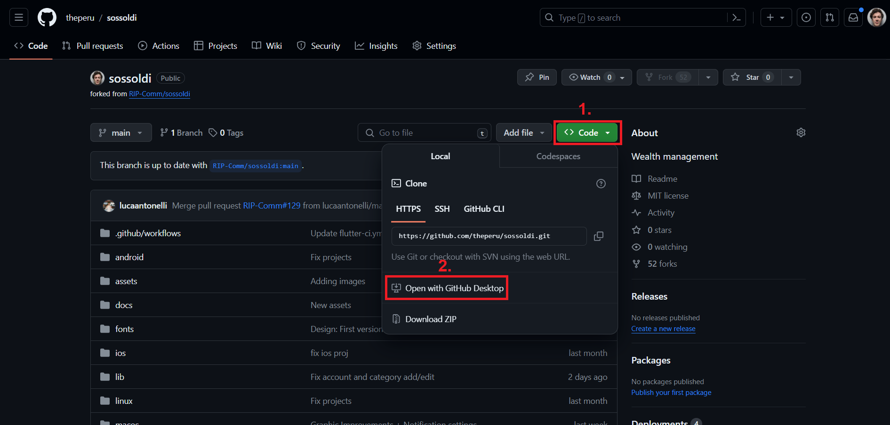
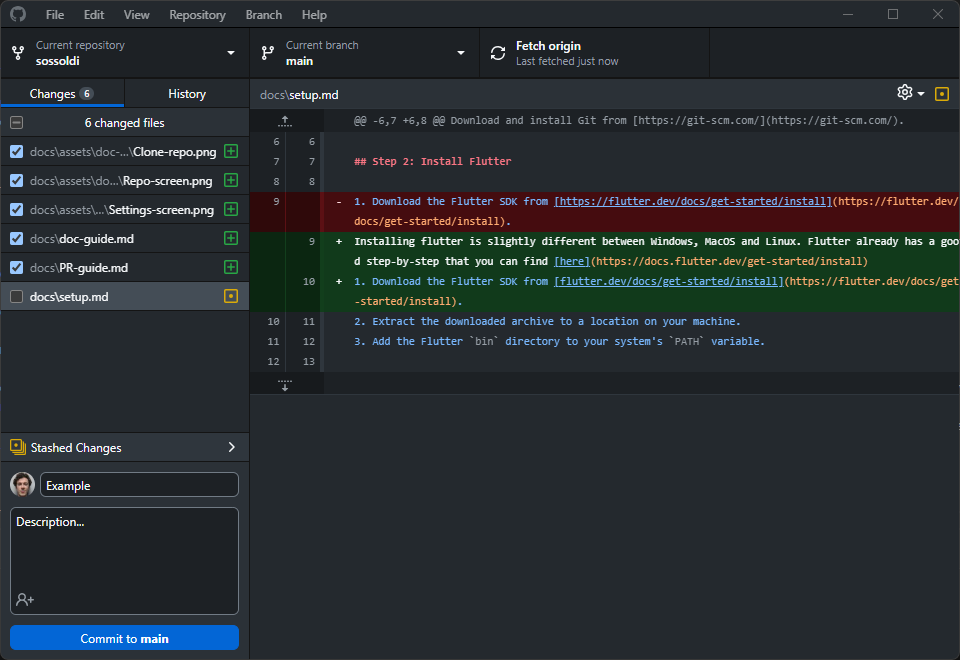
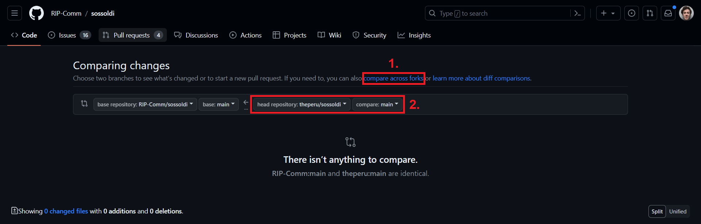

# GitHub for beginners

So you want to partecipate in our project but you don't know how? Don't worry, this guide is here for you.
In the next steps we will assume that you already completed the environment setup. If you haven't, make sure to follow *the first 3 steps* of [this guide](setup.md) first.

## Step 1: Download GitHub Desktop

This is pretty straightforward, go to this [link](https://desktop.github.com/) and download GitHub Desktop. With this it will be easier to manage and submit the changes that you will do. 
After the download, set up your account.

## Step 2: Clone the repository
Now comeback to your repository on GitHub and click on Code -> Open with GitHub Desktop

    

This will open GitHub Desktop and it should ask you to add the path in which you want to save the folder with the project. Then click on clone.

## Step 3: Make the changes

Now you can open the project on your favorite IDE and make the changes that you want.

## Step 4: Commit the changes

When you are done, come back to GitHub Desktop and it should show the changes that you made on the left. Select the files that are necessary for the feature that you have implemented. Underneath them you will find the commit, write a description for the changes and click on commit.
**NOTE:** most of the times you will see a lot changes here but you should select ONLY the files that you changed and are needed for the feature that you have implemented. You should also remove all the ones edited/created by your IDE.

    

## Step 5: Push your changes

On the top right now you should see the option to push your changes, after that they will be visible in your personal repository.

## Step 6: Create the pull request

Congrats this is the last step! Now go back to the [main repository](https://github.com/RIP-Comm/sossoldi/pulls) and create a new pull request by clicking on the top right. 

    

Tap on “compare across forks” and then select your repository.
After that tap on “Create pull request” and write a title and a description for it. 
Congratulations now you are ready to submit it!

Thank you for taking your time in helping our project!

*If you want to learn a bit more about the differences between Git, GitHub and GitHub Desktop you can watch this [video](https://www.youtube.com/watch?v=8Dd7KRpKeaE&ab_channel=CoderCoder)*
