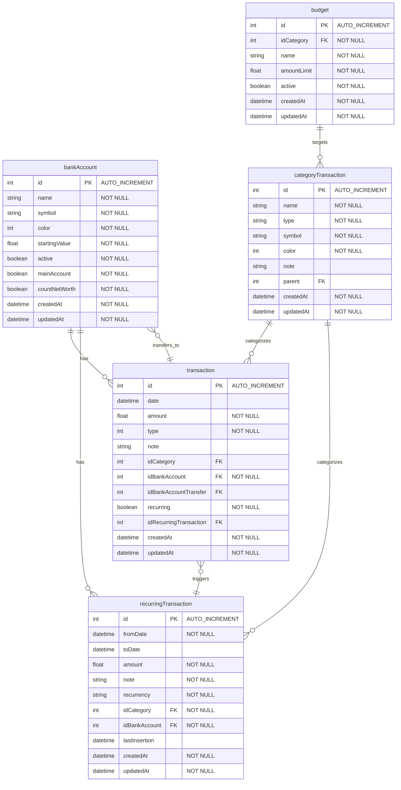
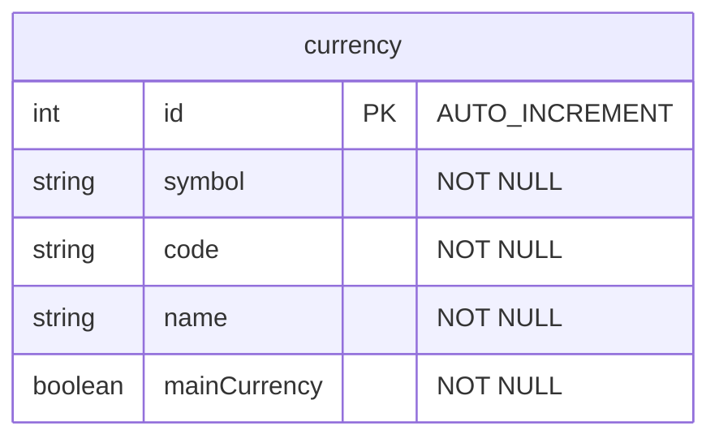

 > Note: The foreign keys (FK) shown in this schema are not explicitly defined in the database schema, 
but are included here to better illustrate the structure.

### currency table doesn't have any relationships with other tables.

