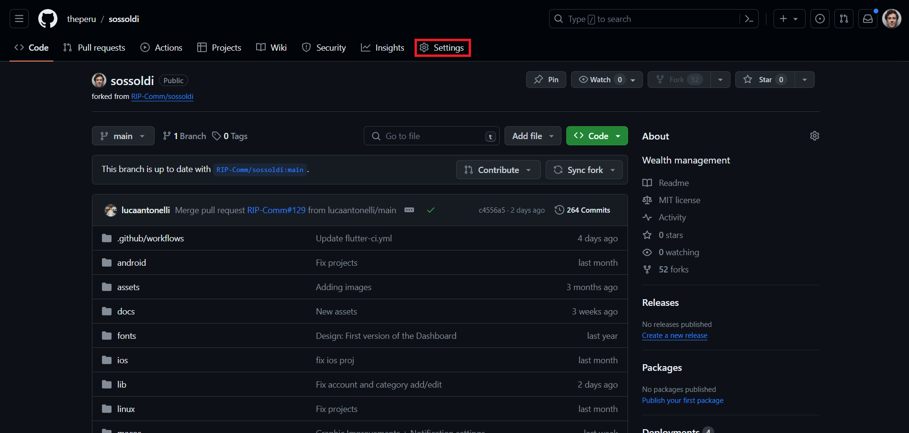
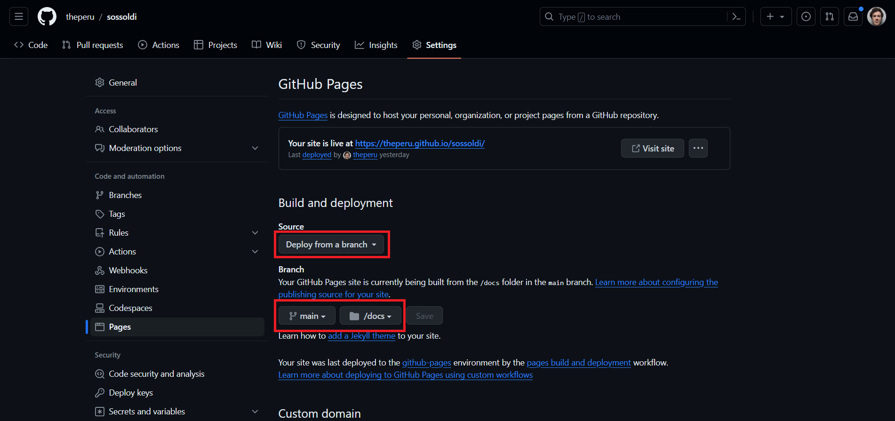

# How to contribute to the documentation

For our documentation we use GitHub Pages and this allows us to have a static page with all the info about the repo. This is very useful for use because it makes the docs easy to read and mantain by just using .md files that will then be converted to HTML. 
If you want you can read more about GitHub Pages in the [official documentation](https://pages.github.com/), you can also read more about markdown files [here](https://www.markdownguide.org/getting-started/).
In the next steps we will assume that you already completed the setup. If you haven't, make sure to follow [this guide](setup.md) first.

## Step 1: Enable GitHub Pages inside your fork

GitHub already offers a great guide on how to do this but basically what you need to do is:
1. Go inside the your repository and select settings

    

2. Click **Pages** inside the section *Code and automation*.
3. Then select **Deploy from branch** in *Source* and and make sure to select the main branch and the */docs* folder

    

4. You can now click **Save** and in a few seconds your page should be online at **{your-username}.github.io/sossoldi/**

## Step 2: Make the changes in your repository

Now that you have enabled the GitHub page you can start making changes and it's pretty straightforward. You can just make changes to the markdown files inside the *docs* folder or create new ones if are needed. 
If you are making a new page make sure that it is linked to another so that the viewers will be able to reach it. Linking the markdown files it's pretty simple and you can find a lot of examples in our repo (you can also read more [here](https://www.codecademy.com/resources/docs/markdown/links)).

Once you've finished making all the changes you can create a commit to your fork and in a few seconds the page should update with all the changes. At this point you should verify that everything looks great and that there are no issue reaching the page.

## Step 3: Create a PR

If everything went to plan now you should be able to create a PR explaining the changes that you made, in order to facilitate the review process make sure to explain what you have done and add useful screenshots (if you prefer you can just share the link *{your-username}.github.io/sossoldi/*). 
After the review process your PR will be merged and your changes should be online!

*Don't know how to open a PR? Don't worry, you can read the [guide](PR-guide.md)*
