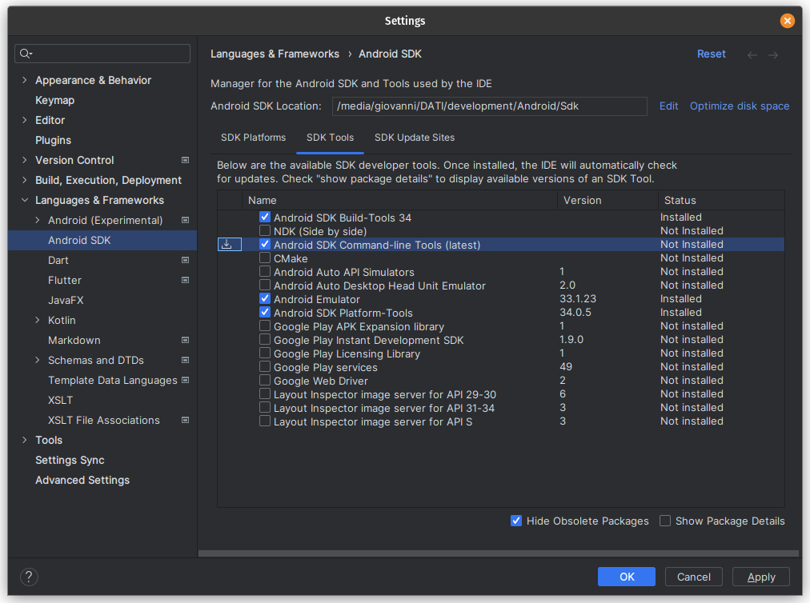

# Linux Dev Environment Configuration

The instructions below provide guidance on configuring the development environment for a Flutter application
on a **Linux** platform, specifically **Pop!_OS**.

It's essential to note that there are multiple options for the required software,
and various installation methods can be employed.
You have the flexibility to choose an alternative approach that suits your preferences.


## What we will use

- **Operating System:**
    - Pop!_OS (derived from Ubuntu)
- **SDKs:**
    - Flutter SDK
    - Android SDK
    - Java JDK 17
- **IDE (Integrated Development Environment:**
    - IntelliJ IDEA Community Edition
- **Android device** (recommended, but not mandatory)
  - tested with Android 13

Make sure you have a substantial amount of available space on your pc, at least 8 to 10 GB,
to accommodate the IDE and the SDKs.


## STEP 1: Clone the project

Clone the project to a location of your choice:   

```
cd ~/projects
git clone https://github.com/RIP-Comm/sossoldi.git
```

## STEP 2: Install IntelliJ IDEA Community Edition via JetBrains Toolbox

1. **Download JetBrains Toolbox App**: You can download the .tar.gz Toolbox App from the [official JetBrains Toolbox App webpage](https://www.jetbrains.com/toolbox-app/).

2. **Install JetBrains Toolbox App**:
    - Open your terminal.
    - Change the directory to where you want to install JetBrains Toolbox. For example, you can install it in the `/opt/` directory:
        ```bash
        cd /opt/
        ```
    - Extract the downloaded tar.gz file (replace `jetbrains-toolbox-1.xx.xxxx.tar.gz` with the name of your downloaded file):
        ```bash
        sudo tar -xvzf ~/Downloads/jetbrains-toolbox-1.xx.xxxx.tar.gz
        ```
    - (Optional) Rename the extracted folder for easier access in the future (replace `jetbrains-toolbox-1.xx.xxxx` with the name of your extracted folder):
        ```bash
        sudo mv jetbrains-toolbox-1.xx.xxxx jetbrains
        ```
    - Open JetBrains Toolbox:
        ```bash
        /opt/jetbrains/jetbrains-toolbox
        ```
    - If you can't open the file, you may need to install `libfuse2`:
        ```bash
        sudo apt install libfuse2
        ```

3. **Run JetBrains Toolbox App**: After you have installed the Toolbox App, run it. You will see its icon in the notification area.

4. **Select IntelliJ IDEA Community Edition**: Click on the Toolbox App icon and select IntelliJ IDEA Community Edition for installation.


## STEP 3: Install Flutter SDK 

In the [official Linux installation guide](https://docs.flutter.dev/get-started/install/linux) follow:

1. Check the [system requirements](https://docs.flutter.dev/get-started/install/linux#system-requirements)
2. Perform the [manual installation](https://docs.flutter.dev/get-started/install/linux#method-2-manual-installation) and download the Flutter SDK (.tar.xz)
3. Extract the .tar.xz in a "development" directory you choose:

   ```
   cd ~/development
   tar xf ~/Downloads/flutter_linux_3.16.2-stable.tar.xz
   ```

4. Add the flutter binary directory on PATH variable:

   - Ensure you are in the `development` directory.
   - Run the following command to add Flutter to your ~/.bashrc file:

      ```
      echo "export PATH=\"\$PATH:`pwd`/flutter/bin\"" >> ~/.bashrc
      ```

      <details>
      <summary>Explanation command</summary>

      *   `echo`: This is a command that outputs the strings it is being passed as arguments.
      *   `"export PATH=\"\$PATH:pwd/flutter/bin\""`: This is the string that `echo` is outputting. It’s a command to add the `flutter/bin` directory to your `PATH`.
          *   `export`: This is a command that makes the variable you are setting available to child processes of the current shell.
          *   `PATH`: This is an environment variable that tells the shell which directories to search for executable files.
          *   `\$PATH`: This is your current `PATH`. The `\` before `$PATH` is an escape character, which means the `$PATH` variable will be written as is to the `~/.bashrc` file, instead of being replaced with its value in the `echo` command.
          *   \`pwd\`/flutter/bin: This is the directory you’re adding to your `PATH`. `pwd` is a command that outputs the path of the current directory, so this refers to the `flutter/bin` directory in the current directory.
      *   `>> ~/.bashrc`: This redirects the output of the `echo` command to the end of the `~/.bashrc` file. `~/.bashrc` is a script that runs every time you start a new shell. By adding the `export` command to this file, you’re ensuring that the updated `PATH` is available every time you start a new shell.
      </details>

    - Alternatively, manually add the following line to your ~/.bashrc 

      (the previous command does this automatically):

      <pre><code>
      export PATH="$PATH:<i>/your/base/path</i>/development/flutter/bin"
      </code></pre>

      **Note**: Make sure to replace `/your/base/path` with the actual path where you have extracted the Flutter SDK.

> ⚠️ **Remember to refresh your terminal.** You can do this by closing and reopening your terminal or running the following command:
> ```
> source ~/.bashrc
> ```


## STEP 4: Check what you need

Now, run the following command:

```bash
flutter doctor
```

and for better detail:

```bash
flutter doctor -v
```

You should see an output similar to this:

```
[✗] Linux toolchain - develop for Linux desktop
    ✗ clang++ is required for Linux development.
      It is likely available from your distribution (e.g.: apt install clang), or can be downloaded from https://releases.llvm.org/
    ✗ CMake is required for Linux development.
      It is likely available from your distribution (e.g.: apt install cmake), or can be downloaded from https://cmake.org/download/
    ✗ ninja is required for Linux development.
      It is likely available from your distribution (e.g.: apt install ninja-build), or can be downloaded from https://github.com/ninja-build/ninja/releases
    ✗ GTK 3.0 development libraries are required for Linux development.
      They are likely available from your distribution (e.g.: apt install libgtk-3-dev)

[✗] Android toolchain - develop for Android devices
    ✗ Unable to locate Android SDK.
      Install Android Studio from: https://developer.android.com/studio/index.html
      On first launch it will assist you in installing the Android SDK components.
      (or visit https://flutter.dev/docs/get-started/install/linux#android-setup for detailed instructions).
      If the Android SDK has been installed to a custom location, please use
      `flutter config --android-sdk` to update to that location.
```

This will help you identify if you need to install:

**For Linux Build:**
- Some necessary dependencies are available in the repository

**For Android Build:**
- Android SDK
- SDK Tools
- Java JDK


## STEP 5: Install Linux dependencies

Install the following dependencies using the package manager:

```
sudo apt-get install clang cmake git ninja-build pkg-config libgtk-3-dev liblzma-dev libstdc++-12-dev
```

These dependencies should be sufficient for your Linux environment.

## STEP 6: Install Android dependencies

### 6.1 Download Java JDK

1. When you open the project in IntelliJ IDEA, it may suggest you to set the JDK 17. If it’s not already installed, it will suggest you to download it and by default, it will be placed in the `~/.jdks` directory.
2. If any suggestion appeared, navigate to `File | Project Structure` and select `Project`.
3. If the necessary JDK is already defined in IntelliJ IDEA, select it from the `Project SDK` list.
4. If the JDK is installed on your computer, but not defined in the IDE, select `Add SDK | JDK`, and specify the path to the JDK home directory.
5. If you don't have the necessary JDK on your computer, select `+ Add SDK | Download JDK...`.
6. In the next dialog, specify the JDK vendor, version, change the installation path if required, and click `Download`.
7. Follow the instructions to download and install JDK 17.
8. Set the `JAVA_HOME` variable in the `~/.bashrc` file:

```
export JAVA_HOME="$HOME/.jdks/corretto-17.x.x/"
export PATH="$PATH:$JAVA_HOME"
```

**Note**: Make sure to replace `corretto-17.x.x` with the actual version you downloaded.

> ⚠️ **Remember to refresh your terminal.** You can do this by closing and reopening your terminal or running the following command:
> ```
> source ~/.bashrc
> ```


### 6.2 Installation for Android SDK

1. Launch **IntelliJ IDEA**.
2. Initiate the creation of a new Android Project.
3. In the setup wizard that appears, select **Install Android SDK**.
4. Specify your desired custom path for the installation.

After the installation, you can set the Android SDK in Flutter by running the following command:

```bash
flutter config --android-sdk /path/of/installation/Android/Sdk
```

**Note**: Please replace `/path/of/installation/` with your actual Android SDK path (for example with your `development` directory used previously)


### 6.3 Install cmdline-tools with Intellij

1. Open **IntelliJ IDEA**.
2. Navigate to **Languages & Frameworks**.
3. Select **Android SDK**.
4. Go to **SDK Tools**.
5. Check the box for **Android SDK Command-line Tools (latest)**.



## STEP 7: Accept licence

 ```
 flutter doctor --android-licenses
 ```

## STEP 8: Enable Android device

If you want to run the application on your Android real device:

On your device: 
1. Enable [developer options](https://developer.android.com/studio/debug/dev-options#enable)
2. Enable [USB debugging](https://developer.android.com/studio/debug/dev-options#Enable-debugging)
3. Connect your device to the pc and select `File Transfer/Android Auto` 


## STEP 9: Final check

At this point your environment should be configurated.

On your pc:
1. Run the following command: 
   ```
   flutter doctor -v
   ```

    This is an example of correct output:

    ```
    [✓] Flutter (Channel stable, 3.16.2, on Pop!_OS 22.04 LTS 6.5.6-76060506-generic, locale en_US.UTF-8)
        • Flutter version 3.16.2 on channel stable at /media/giovanni/DATI/development/flutter
        • Upstream repository https://github.com/flutter/flutter.git
        • Framework revision 9e1c857886 (9 days ago), 2023-11-30 11:51:18 -0600
        • Engine revision cf7a9d0800
        • Dart version 3.2.2
        • DevTools version 2.28.3

    [✓] Android toolchain - develop for Android devices (Android SDK version 34.0.0)
        • Android SDK at /media/giovanni/DATI/development/Android/Sdk/
        • Platform android-34, build-tools 34.0.0
        • Java binary at: /home/giovanni/.jdks/corretto-17.0.9/bin/java
        • Java version OpenJDK Runtime Environment Corretto-17.0.9.8.1 (build 17.0.9+8-LTS)
        • All Android licenses accepted.

    [✗] Chrome - develop for the web (Cannot find Chrome executable at google-chrome)
        ! Cannot find Chrome. Try setting CHROME_EXECUTABLE to a Chrome executable.

    [✓] Linux toolchain - develop for Linux desktop
        • Ubuntu clang version 14.0.0-1ubuntu1.1
        • cmake version 3.22.1
        • ninja version 1.10.1
        • pkg-config version 0.29.2

    [!] Android Studio (not installed)
        • Android Studio not found; download from https://developer.android.com/studio/index.html
          (or visit https://flutter.dev/docs/get-started/install/linux#android-setup for detailed instructions).

    [✓] IntelliJ IDEA Community Edition (version 2023.2)
        • IntelliJ at /home/giovanni/.local/share/JetBrains/Toolbox/apps/intellij-idea-community-edition
        • Flutter plugin version 76.3.4
        • Dart plugin can be installed from:
          🔨 https://plugins.jetbrains.com/plugin/6351-dart

    [✓] Connected device (2 available)
        • CPH2211 (mobile) • IB69KFDMEEPRFAXG • android-arm64 • Android 13 (API 33)
        • Linux (desktop)  • linux            • linux-x64     • Pop!_OS 22.04 LTS 6.5.6-76060506-generic

    [✓] Network resources
        • All expected network resources are available.
    ```

2. Check if `Android toolchain` and `Linux toolchain` sections are okay.
3. `Android Studio` and `Chrome` sections are not mandatory to build and run the project.


## STEP 10: Build and run the project

1. Navigate to the project directory of `sossoldi`.
2. Connect your device to the pc and select `File Transfer/Android Auto`
3. Run the command `flutter run`